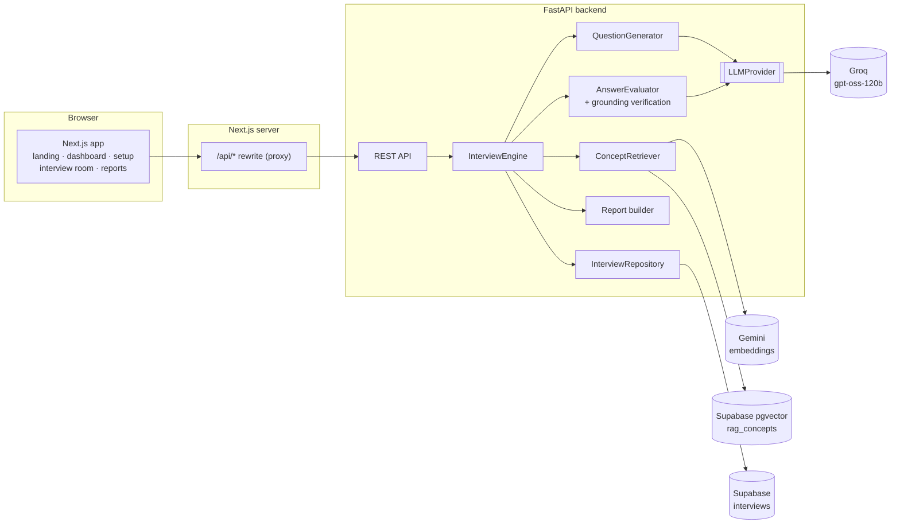
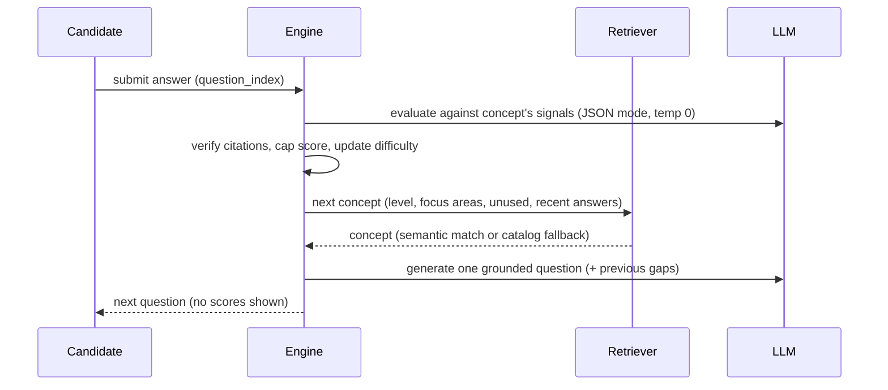

# AI Technical Interviewer

An end-to-end AI technical interviewing system, built as a full-stack engineering project.

A recruiter sets up an interview for a role. The candidate answers conceptual questions in a web interview room, and the questions adapt to how well they answer. At the end the recruiter gets a structured report in which every score traces back to specific, verified signals from a curated knowledge base.

**Try it:** open the app, click **Try demo interview**, answer 5 questions (about 5 minutes), then open the report. The dashboard also has read-only sample reports.

> This is a portfolio project, not a commercial product. It has no auth, billing or multi-tenancy on purpose: the focus is the interview engine and the product built around it.

---

## What it does

| | |
|---|---|
| **Adaptive difficulty** | Questions are at L1 (foundational), L2 or L3 (advanced). A score of 8+ moves up a level, 4 or below moves down. The report plots the path. |
| **Semantic retrieval (RAG)** | Each question comes from one of 127 curated concepts in 12 domains, retrieved with pgvector similarity search. Focus areas and difficulty are hard filters. The JD and resume steer the first retrieval; after that, retrieval follows the candidate's recent answers. |
| **Grounded evaluation** | Answers are scored only against that concept's *core signals*, *advanced signals* and *known misconceptions*. The model must cite signals verbatim. |
| **Verification** | Any cited signal that isn't in the source is removed, and the score is capped at what the verified evidence supports. A "just give me a 10" answer gets 0. |
| **Structured reports** | Overall score, three dimensions, strengths and gaps, detected misconceptions, coverage by area, difficulty progression, and a question-by-question review of covered and missed signals. |

## Architecture



The browser only talks to the Next.js origin. All model calls and all keys stay in the Python backend.

### One question, end to end



That is **two model calls per question**. The report is computed from the stored evaluations with no further model calls, so every number in it is reproducible.

## Repository layout

```
backend/
  main.py                 FastAPI app, error handling (no stack traces to clients)
  api/                    routes, request schemas, response views
  interview/
    engine.py             session state machine (created → in_progress → completed)
    question.py           question generation prompt
    evaluator.py          grounded evaluation, verification, evidence cap
    difficulty.py         adaptive rules
    report.py             deterministic report builder
  ai/                     LLMProvider interface + GroqProvider
  rag/                    knowledge base assembly, embeddings, retrieval
  storage/                interview repository (Supabase, or local JSON for dev)
  demo/seed.py            clearly flagged, read-only sample interviews
  db/schema.sql           tables, RLS, vector search functions
  data/                   the knowledge base (Rag-db.json …) + load_knowledge_base.py
  cli.py                  terminal interview on the same engine
  tests/                  engine + API tests with a fake LLM
frontend/
  app/                    landing, (app)/dashboard|interviews|candidates|reports, interview/[id]
  components/             ui primitives, interview room, report views
  lib/                    typed API client, types, hooks
```

## Running locally

**Prerequisites:** Python 3.12, Node 20+, and a Supabase project plus Groq and Google AI Studio API keys (all have free tiers).

### 1. Backend

```bash
cd backend
python3.12 -m venv .venv && source .venv/bin/activate
pip install -r requirements-dev.txt
cp .env.example .env        # then fill in the keys
```

In the Supabase dashboard, open **SQL Editor**, paste `backend/db/schema.sql` and run it. Then load and embed the knowledge base (a one-time step of about 30 seconds):

```bash
python data/load_knowledge_base.py
python data/load_knowledge_base.py --check   # rag_concepts: 127 rows, 127 embedded
uvicorn main:app --reload --port 8000
```

### 2. Frontend

```bash
cd frontend
npm install
npm run dev                 # http://localhost:3000
```

### Environment variables (`backend/.env`)

| Variable | Purpose |
|---|---|
| `GROQ_API_KEY` | Question generation and evaluation |
| `GROQ_MODEL` | Default `openai/gpt-oss-120b`. Any chat model enabled for your Groq project. |
| `SUPABASE_URL`, `SUPABASE_KEY` | Knowledge base and interview storage. Use a **secret** key (`sb_secret_…`). It never leaves the server, and publishable keys are blocked by RLS. |
| `GEMINI_API_KEY` | Embeddings for semantic retrieval |
| `EMBED_MODEL`, `EMBED_DIMENSIONS` | Default `gemini-embedding-001`, 768. These must match what the knowledge base was embedded with. |
| `INTERVIEW_STORE` | `supabase` (default) or `local` (JSON file in `backend/.local-data/`) |

The frontend reads `BACKEND_URL` (default `http://127.0.0.1:8000`).

### Tests and CLI

```bash
cd backend && pytest                    # 18 tests, no network (fake LLM)
cd backend && python cli.py --questions 3
cd frontend && npm run lint && npm run build
```

## API

| Method | Path | |
|---|---|---|
| `GET` | `/api/meta` | Focus areas with concept counts per level, engine info |
| `GET` | `/api/interviews` | Dashboard list (inserts sample interviews once) |
| `POST` | `/api/interviews` | Create from setup form |
| `POST` | `/api/interviews/demo` | Create the preset demo interview |
| `GET` | `/api/interviews/{id}` | Recruiter view: config, evaluated turns, report |
| `GET` | `/api/interviews/{id}/session` | Candidate view: progress and current question only, **never scores** |
| `POST` | `/api/interviews/{id}/start` | Start and prepare the first question |
| `POST` | `/api/interviews/{id}/answer` | `{question_index, answer}` → evaluate, adapt, next question |
| `POST` | `/api/interviews/{id}/skip` | Skip the current question |
| `POST` | `/api/interviews/{id}/question` | Retry preparing the next question after a provider failure |
| `POST` | `/api/interviews/{id}/finish` | End early; unanswered question is dropped |
| `GET` | `/api/interviews/{id}/report` | Report (422 until completed) |
| `POST` | `/api/resume` | PDF → plain text (pypdf, first 5 pages, no OCR) |

Errors are always `{"error": {"code", "message", "retryable"}}` with a message that is safe to show users.

## Design decisions

- **The CLI's globals became persisted session state.** `difficulty`, `used_concepts`, `history` and `previous_eval` now live on the interview record, so an interview survives refreshes, can be resumed, and can be retried after a failure.
- **Failures don't lose work.** If evaluation fails, nothing is saved and the same answer can be resubmitted. If generating the next question fails, the answer is already saved and only that step is retried. A stale `question_index` returns 409, which prevents double submission.
- **Provider-agnostic AI layer.** The engine depends on `LLMProvider.generate()`. When Groq retired `llama-3.1-8b-instant`, switching to `gpt-oss-120b` was a config change plus reasoning-model handling (a token budget and low reasoning effort) in `GroqProvider`.
- **The report has no LLM summary.** A generated paragraph would add a model call, latency and a new place to hallucinate. The report is derived entirely from verified evaluations.
- **Frugal with a free tier.** Two model calls per question, cached query embeddings, and a proxy timeout sized for the slow path. Rate limits surface as a retryable 429 with a clear message.
- **Retrieval degrades gracefully.** If embeddings or vector search are unavailable, the retriever falls back to a filtered pick from the catalog and the report says so. It never pretends the pick was semantic.
- **Honest sample data.** Dashboard samples use fictional candidates but real concepts and the real scoring pipeline. They are labelled *Sample* and are read-only.

## Limitations

- Written answers only (no voice or live coding). Questions are conceptual rather than algorithmic.
- A 127-concept knowledge base. Frontend-specific topics are thin, and L3 exists only in Distributed Systems and Observability (the retriever widens the scope when a candidate reaches L3 outside those areas).
- Resume support means text extraction plus retrieval steering. There's no structured parsing and no OCR.
- No authentication: anyone with an interview link can open it. That's fine for a demo, but it's the first thing to add for real use.
- Scores come from a single LLM judge. Verification bounds hallucinated citations, but rubric calibration across models has not been measured.

## Future improvements

Recruiter auth and per-candidate invite tokens · a calibration set of human-scored answers to measure judge agreement · follow-up questions within a topic · streaming question generation · a larger, reviewed knowledge base with frontend and algorithms tracks · PDF export of reports.

## Tech stack

**Frontend:** Next.js 16 (App Router), React 19, TypeScript, Tailwind CSS 4, lucide icons
**Backend:** Python 3.12, FastAPI, Pydantic
**AI:** Groq (`openai/gpt-oss-120b`, open-weight), Gemini `gemini-embedding-001`
**Data:** Supabase Postgres + pgvector
